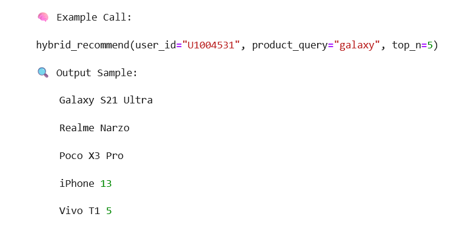

# 🛍️ Amazon Product Recommendation System — Industry Case Study

This project builds and evaluates a **hybrid recommendation engine** for an e-commerce platform using both **content-based** and **collaborative filtering** techniques.

---

## 📌 Problem Statement

> Build a smart recommendation system using product metadata and user behavior data to personalize shopping experiences for Amazon users.

---

## 🗃️ Dataset Summary

| Feature                    | Count / Range                          |
|---------------------------|----------------------------------------|
| Unique Users              | ~X users                               |
| Unique Products           | ~Y products                            |
| Total Ratings/Reviews     | ~Z reviews                             |
| Top 5 Product Categories  | Electronics, Clothing, Mobiles, Footwear, Accessories |
| Price Range               | ₹50 – ₹200,000                         |
| Discount % Range          | 0% – 95%                               |

---

## 🔧 Tools & Libraries

- **Python**, **Pandas**, **NumPy**
- **Matplotlib**, **Seaborn**
- **Scikit-learn**, **TF-IDF**
- **Cosine Similarity**, **Collaborative Filtering**

---

## 🧼 Section A: Data Understanding & Cleaning

- Cleaned and converted:
  - `actual_price`, `discounted_price`, `discount_percentage`
- Normalized `rating` and `rating_count`
- Created derived fields:
  - `price_difference`, `value_for_money_score`, `weighted_rating`
- Split hierarchical `category` into 3 levels
- Handled missing values and dropped duplicates

---

## 📊 Section B: Exploratory Data Analysis (EDA)

Visualized:
- Most reviewed products
-   
- Top categories by product count
- Average rating per category
- 
- Discount vs actual price correlation
- 

🧠 **Insights:**
1. Some high-rated products have very few reviews (opportunity for exposure)
2. Heavy discounts correlate moderately with higher review counts
3. Mobile phones dominate both in volume and rating count

---

## 🧠 Section C: Content-Based Filtering

- Vectorized `product_name + about_product` using **TF-IDF**
- Calculated cosine similarity to recommend similar products
- Enhanced with category and price-weighted similarity
- Recommended items even for new/unrated products

---

## 🤝 Section D: Collaborative Filtering

- Created a **User–Item Matrix** with ratings
- Implemented **User-User Collaborative Filtering** using cosine similarity
- Recommended top N unseen products per user

---

---

## 🔀 Section E: Hybrid Recommender System

This section combines both content-based and collaborative filtering models to build a hybrid system that improves recommendation accuracy and robustness.

### ✅ Hybrid Scoring Formula

We use a weighted score combination:

- `Hybrid Score = 0.6 * Collaborative Score + 0.4 * Content Score`

This helps balance personalized recommendations with metadata-based relevance.

---

### 💡 Features of the Hybrid Model

- Handles **cold-start users** by falling back to content-based similarity
- Improves personalization for **active users** by including user-item behavior
- Offers more **diverse** and **relevant** product suggestions

---

### 📌 Evaluation Strategy

| Scenario                | Recommendation Strategy             |
|-------------------------|--------------------------------------|
| Cold-start Product       | Use Content-Based Similarity         |
| Cold-start User          | Use Content-Based Similarity         |
| Returning User + Known Product | Use Hybrid Score Fusion       |

---

### 📊 Strengths of the Hybrid Model

- Leverages both behavioral and product metadata
- Prevents overfitting to a single model
- Boosts recommendation accuracy in sparse data situations
- Customizable fusion weights for experimentation

---

### 🧠 Possible Enhancements

To further improve the hybrid system:

- Add **popularity score** (number of purchases)
- Consider **recent interactions** for freshness
- Apply **product availability filters**
- Introduce **diversity boosting** for top-N results

---

## 📈 Section F: Business Strategy & Deployment

### ✅ Best Model by User Type

| User Type         | Recommended Model        |
|------------------|--------------------------|
| New Users         | Content-Based Filtering  |
| Returning Users   | Collaborative Filtering  |

---

### 📦 Recommending Products with No Ratings

Use **Content-Based Filtering** leveraging:
- Product name and description
- Category similarity
- Price and discount proximity

---

### 🚀 Production Deployment Plan

| Component             | Technology                         |
|----------------------|-------------------------------------|
| Model Serving         | Flask / FastAPI + Gunicorn         |
| Batch Processing      | Apache Airflow / AWS Glue          |
| Real-Time Stream      | Kafka / Amazon Kinesis             |
| Deployment Platform   | Docker + Kubernetes                |
| Storage Layer         | Redis (cache), PostgreSQL (fallback) |
| Monitoring            | Prometheus / Grafana               |

---

### 📊 Key KPIs to Track

| KPI Name               | Description                                                  |
|------------------------|--------------------------------------------------------------|
| Click-Through Rate (CTR) | % of users clicking recommended products                   |
| Conversion Rate         | % of recommendations that lead to purchases                 |
| Add-to-Cart Rate        | % of recommended products added to cart                     |
| Revenue per Session     | Average order value driven by recommendations               |
| Precision@K / Recall@K  | Accuracy and relevance of top-N recommendations             |
| Diversity / Novelty Score | Ensures variety in product suggestions                    |

---

### ✅ Summary of Section F

- **Cold-start solutions**: Handled via content metadata
- **Hybrid models**: Provide flexibility and balance
- **Production-ready**: Real-time + batch pipelines integrated
- **KPIs defined**: To measure user impact and business success

### 🤖 Sample Recommendations Output (Hybrid Model)

👨‍💻 Author

Parameswaran P
Public Cloud Architect | AI/ML Enthusiast
📍 Tamil Nadu, India
